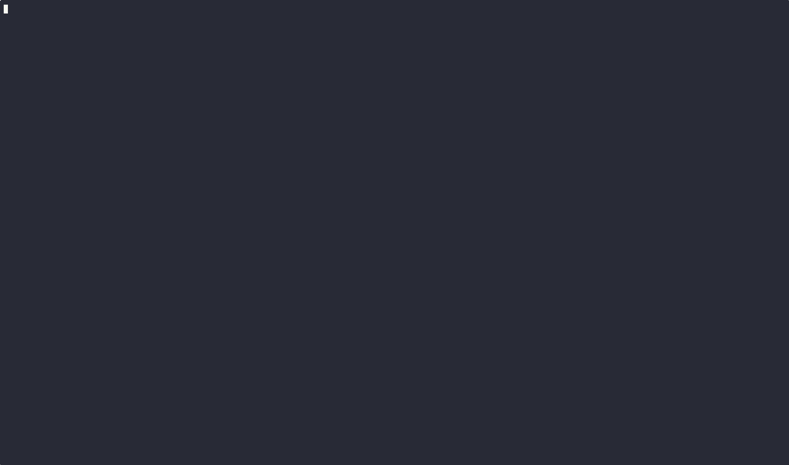
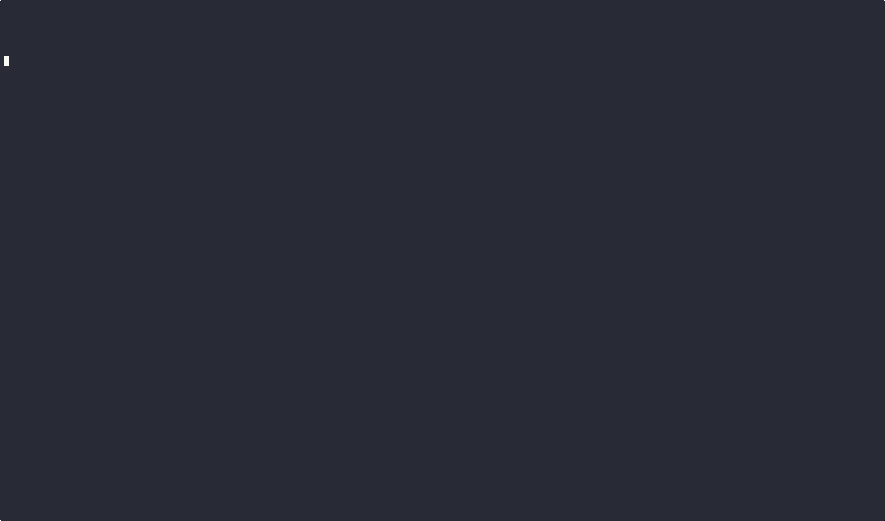
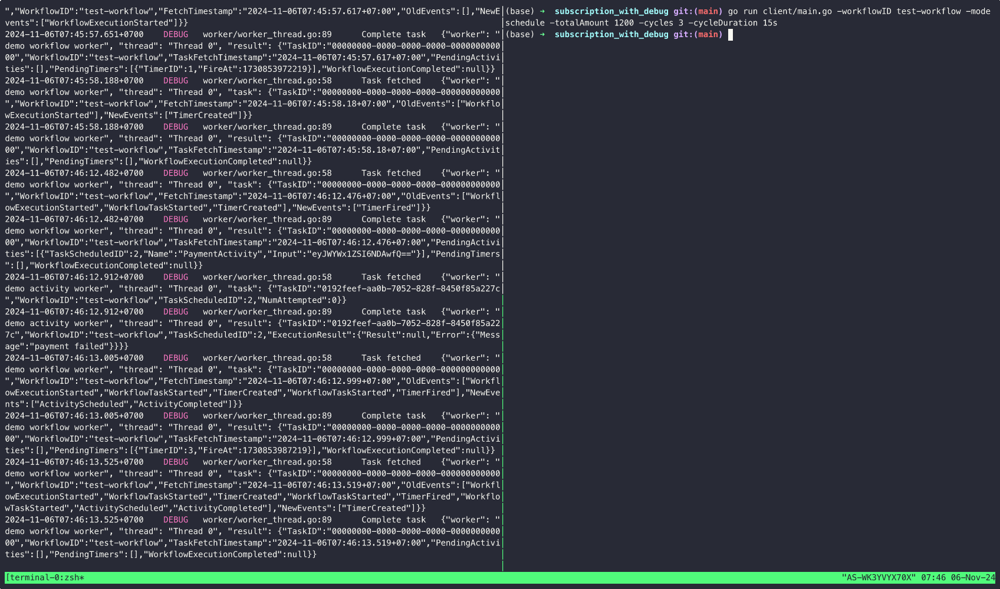

simple-workflow-go
===

A simple workflow framework written in Go

[TODO insert image here]

## Demo


## Quickstarts

### Backend
Backend is responsible for persisting workflow state, including tasks, events, workflow runtime metadata.

In this example, we will use PSQL as backend.

First, start PSQL server locally

```shell
docker compose -f docker/docker-compose-psql.yaml up -d
```

Then, init a backend instance that connect to PSQL server

```go
const (
    DbHost     = "localhost"
    DbPort     = 5432
    DbName     = "postgres"
    DbUser     = "user"
    DbPassword = "123456"
)

func InitPSQLBackend(logger *zap.Logger) (backend.Backend, error) {
    hostname, err := os.Hostname()
    if err != nil {
        return nil, err
    }
    db, err := psql.Connect(DbHost, DbPort, DbUser, DbPassword, DbName, nil)
    if err != nil {
        return nil, err
    }
    err = psql.PrepareDB(db) // auto-create table if not exists
    if err != nil {
        return nil, err
    }
    dataConverter := dataconverter.NewJsonDataConverter()
    be := psql.NewPSQLBackend(hostname, 5*time.Minute, dataConverter, db, logger)
    return be, nil
}
```

```go
be, err := examples.InitPSQLBackend(logger)
```

### Activities
Activity is a function that used to implement service calls, I/O operation, 
long-running operations, or costly actions which are not prefer to be re-executed

```go
type PaymentInput struct {
    Value int64
}

func PaymentActivity(ctx context.Context, input *PaymentInput) (*Void, error) {
    r := rand.Intn(100)
    if r < 30 { // 30% of failure
        return &Void{}, nil
    } else {
        return nil, errors.New("payment failed")
    }
}
```

**note #1**: code inside activity must be non-deterministic, which is when running the activity twice, 
it always yields the same result 

**note #2**: if you experience an unexpected error while executing activity, 
just call `panic(...)`, the activity will be retried later

### Workflow

Workflow is the orchestration of activities

```go
type SubscriptionWorkflowInput struct {
    TotalAmount   int64
    Cycles        int
    CycleDuration time.Duration
}

type SubscriptionWorkflowOutput struct {
    Paid    int64
    Overdue int64
}

func SubscriptionWorkflow(ctx context.Context, input *SubscriptionWorkflowInput) (*SubscriptionWorkflowOutput, error) {
    startTimestamp := workflow.GetWorkflowExecutionStartedTimestamp(ctx)
    paymentAmounts := calculatePaymentCycles(input.TotalAmount, input.Cycles)
    paymentTimings := calculatePaymentTimings(startTimestamp, input.Cycles, input.CycleDuration)
    //
    var paid int64 = 0
    var overdue int64 = 0
    currentCycle := 0
    for {
        workflow.SetVar(ctx, "paid", paid)
        workflow.SetVar(ctx, "overdue", overdue)
        workflow.SetVar(ctx, "currentCycle", currentCycle)
        if currentCycle >= input.Cycles {
            break
        }
        currentCycleAmount := paymentAmounts[currentCycle]
        amountToPay := currentCycleAmount + overdue
        workflow.SetVar(ctx, "amountToPay", amountToPay)
        workflow.WaitUntil(ctx, time.UnixMilli(paymentTimings[currentCycle]))
        _, err := workflow.CallActivity(ctx, PaymentActivity, &PaymentInput{Value: amountToPay}).Await()
        if err != nil {
            overdue += paymentAmounts[currentCycle]
            workflow.SetVar(ctx, fmt.Sprintf("cycle_%d_err", currentCycle), err.Error())
        } else {
            paid += amountToPay
            overdue = 0
            workflow.SetVar(ctx, fmt.Sprintf("cycle_%d_paid_amount", currentCycle), amountToPay)
        }
        workflow.SetVar(ctx, "amountToPay", 0)
        workflow.SetVar(ctx, fmt.Sprintf("cycle_%d_completed_at", currentCycle), workflow.GetCurrentTimestamp(ctx))
        currentCycle += 1
    }
    return &SubscriptionWorkflowOutput{
        Paid:    paid,
        Overdue: overdue,
    }, nil
}
```

**note #1**: DO NOT put any costly operations (IO operations, external service calls, etc.) on workflow code, 
put them in activity code instead

### Workers

Workers, including `ActivityWorker` and `WorkflowWorker` are responsible for executing activity and workflow codes

#### ActivityWorker
```go
aw, err := worker.NewActivityWorkersBuilder().
    WithName("demo activity worker").
    WithBackend(be).
    WithLogger(logger).
    RegisterActivities(
        PaymentActivity,
    ).
    WithActivityWorkerOpts(
        activity_worker.WithTaskProcessorMaxBackoffInterval(1 * time.Minute),
    ).
    Build()
```

#### WorkflowWorker

```go
ww, err := worker.NewWorkflowWorkersBuilder().
    WithName("demo workflow worker").
    WithBackend(be).
    WithLogger(logger).
    RegisterWorkflows(
        SubscriptionWorkflow,
    ).Build()
```

### Putting all together

Putting all pieces together, we can implement our worker program

```go
func main() {
    ctx := context.Background()
    logger, err := examples.GetLogger()
    if err != nil {
        panic(err)
    }
    be, err := examples.InitPSQLBackend(logger)
    if err != nil {
        panic(err)
    }
    aw, err := worker.NewActivityWorkersBuilder().
        WithName("demo activity worker").
        WithBackend(be).
        WithLogger(logger).
        RegisterActivities(
            PaymentActivity,
        ).
        WithActivityWorkerOpts(
            activity_worker.WithTaskProcessorMaxBackoffInterval(1 * time.Minute),
        ).
        Build()
    if err != nil {
    panic(err)
    }
    ww, err := worker.NewWorkflowWorkersBuilder().
        WithName("demo workflow worker").
        WithBackend(be).
        WithLogger(logger).
        RegisterWorkflows(
            SubscriptionWorkflow,
        ).Build()
    if err != nil {
        panic(err)
    }
    aw.Start(ctx)
    defer aw.Stop(ctx)
    ww.Start(ctx)
    defer ww.Stop(ctx)
    //
    sigs := make(chan os.Signal, 1)
    signal.Notify(sigs, syscall.SIGINT, syscall.SIGTERM)
    <-sigs
}
```

#### Result


### Starting a workflow 

After having our worker instance running, we can write codes to start workflows and wait for their result

#### Start workflow

To schedule a workflow, call `ScheduleWorkflow`, and then fill out the necessary parameters to start the workflow

```go
err := client.ScheduleWorkflow(ctx, be, SubscriptionWorkflow, &SubscriptionWorkflowInput{
    TotalAmount: totalAmount,
    Cycles:      cycles,
}, client.WorkflowScheduleOptions{
    WorkflowID: workflowID,
    Version:    "1",
})
```

#### Result


#### Debugging a running workflow

First, to debug a running workflow, we have to put several runtime variables inside the workflow.

We will use method `SetVar[T any](ctx context.Context, name string, value T)` which is used to modify a runtime variable.
After that, we will use the WorkflowDebugger to debug the current runtime state by getting those variables out.

```go
dbg := debug.NewWorkflowDebugger(be)
vars, err := dbg.QueryUserDefinedVars(SubscriptionWorkflow, workflowID)
if err != nil {
    panic(err)
}
PrettyPrint(vars)
```

#### Result


#### Await workflow result

To wait for a workflow execution to complete and get its result, call `AwaitWorkflowResult` method

```go
workflowResult, workflowErr, err := client.AwaitWorkflowResult(ctx, be, SubscriptionWorkflow, workflowID)
```

#### Result


all above code were taken from [subscription_with_debug](examples/subscription_with_debug) example

## Examples

See [examples](examples)